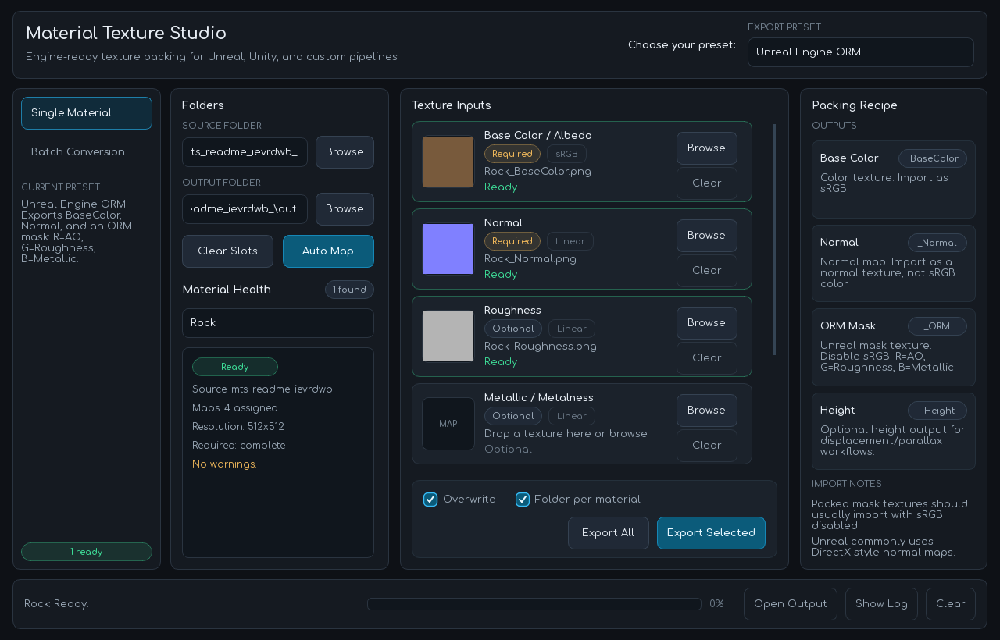
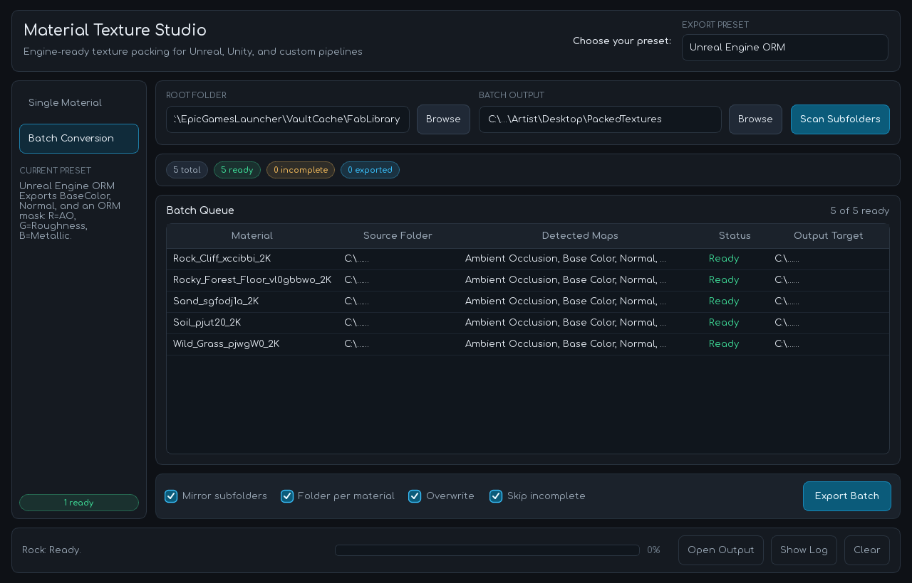
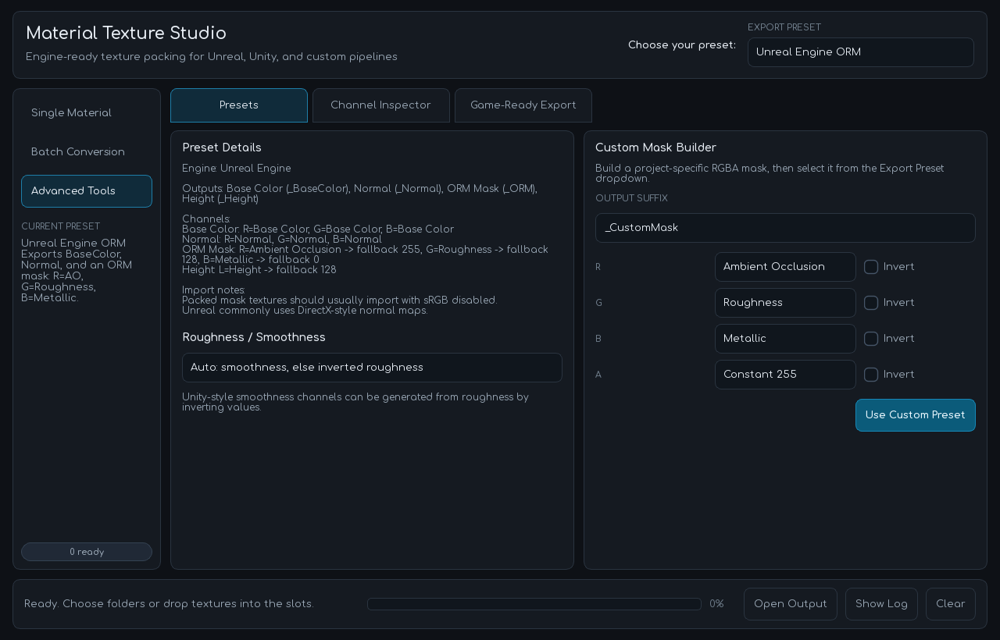
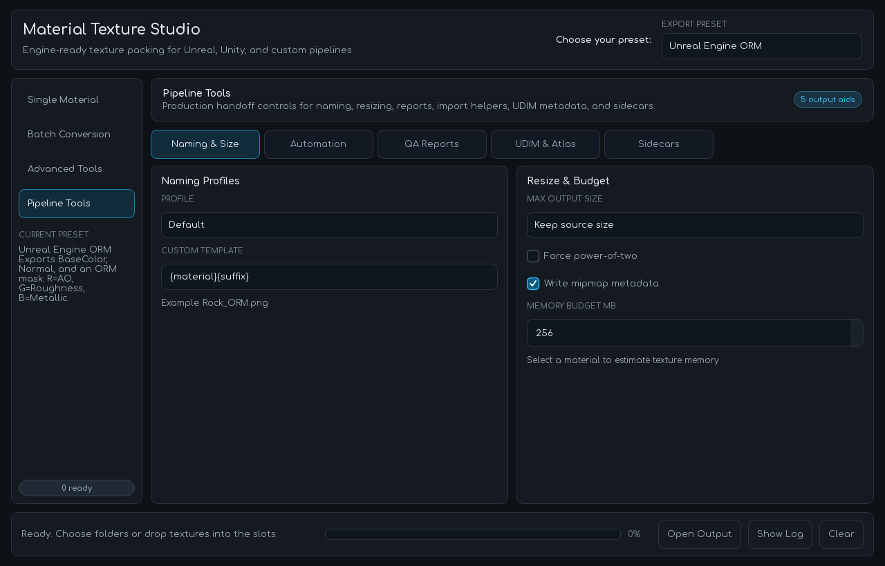

# Material Texture Studio

Material Texture Studio is a modern PyQt6 desktop tool for artists and technical artists who need to detect, preview, validate, and pack material texture maps for engine-ready workflows.

It supports single-material setup, batch conversion, drag-and-drop map assignment, thumbnail previews, preset-driven channel packing, and export manifests.









## Features

- Detects material texture sets from source folders.
- Supports manual texture assignment with browse buttons and drag-and-drop.
- Shows compact texture thumbnails and color-space hints.
- Provides a Material Health panel with readiness, assigned maps, texture resolution, required-map status, and warnings.
- Batch-scans nested folders and groups materials by source folder.
- Exports packed textures using engine presets.
- Includes Advanced Tools for custom RGBA masks, channel inspection, roughness/smoothness conversion, and game-ready compression guidance.
- Adds Pipeline Tools for naming conventions, resize/POT processing, memory estimates, import helper scripts, UDIM metadata, color audits, KTX2 command plans, reports, atlas previews, and studio sidecars.
- Shows export progress, logs, summaries, and an Open Output action after successful export.
- Remembers the last folders, preset, mode, and export options.
- Writes manifest JSON files with inputs, outputs, preset details, import notes, warnings, and optional game-ready profile recommendations.

## Export Presets

- **Unreal Engine ORM**
  - BaseColor
  - Normal
  - ORM mask: `R = AO`, `G = Roughness`, `B = Metallic`
  - Optional Height

- **Unity URP Lit**
  - BaseMap
  - Normal
  - URP Mask: `R = Metallic`, `G = Occlusion`, `A = Smoothness`
  - Roughness is inverted into smoothness when smoothness is missing.

- **Unity HDRP Mask Map**
  - BaseColor
  - Normal
  - HDRP MaskMap: `R = Metallic`, `G = AO`, `B = Detail Mask`, `A = Smoothness`

- **Godot ORM**
  - Albedo
  - Normal
  - ORM texture: `R = AO`, `G = Roughness`, `B = Metallic`

- **glTF Metallic-Roughness**
  - BaseColor
  - Normal
  - Metallic Roughness: `G = Roughness`, `B = Metallic`
  - Optional Occlusion

- **Legacy Mobile Two-Texture Pack**
  - Packed Base: `RGB = Base Color`, `A = Roughness`
  - Packed Normal: `R/G = Normal X/Y`, `B = AO`, `A = Height`

## Advanced Tools

- **Presets** shows the active channel recipe, import notes, and roughness/smoothness conversion mode.
- **Custom Mask Builder** creates a project-specific RGBA mask preset with per-channel source and invert controls.
- **Channel Inspector** previews individual output channels as grayscale before export.
- **Game-Ready Export** adds profile guidance for Desktop/Console BC, Mobile ASTC, Android ETC2, and Web/KTX2 workflows.

## Pipeline Tools

- **Naming & Size** applies naming profiles, custom filename templates, max-size resizing, power-of-two resizing, mipmap metadata, and memory budget estimates.
- **Automation** writes Unreal Python, Unity Editor, and Godot helper files, plus optional KTX2/Basis command plans or automatic conversion when a supported tool is available.
- **QA Reports** writes HTML/CSV material reports with output dimensions, memory estimates, warnings, and color-space audit data.
- **UDIM & Atlas** detects `1001`-style UDIM tiles, writes virtual-texture metadata, creates atlas/contact-sheet previews, and writes texture transform metadata.
- **Sidecars** writes lightweight OpenUSD and MaterialX JSON sidecars for larger asset-pipeline handoff.

## Supported Maps

- Base Color / Albedo
- Normal
- Roughness
- Smoothness / Gloss
- Metallic / Metalness
- Ambient Occlusion
- Height / Displacement
- Opacity / Alpha
- Emissive
- Detail Mask

## Install For Windows

Download the latest Windows executable from the [GitHub Releases page](https://github.com/moshtaqi/Texture-Packer/releases).

For v1.2, download:

```text
MaterialTextureStudio-v1.2.exe
```

The `.exe` is self-contained and includes the Python runtime, PyQt6, Pillow, NumPy, the bundled Comfortaa font, and the app icon.

## Usage

1. Run `MaterialTextureStudio-v1.2.exe`.
2. Choose a source folder and output folder.
3. Pick an export preset from the top-right preset selector.
4. Use **Auto Map** to detect textures, or assign texture slots manually with **Browse** or drag-and-drop.
5. Check **Material Health** for missing maps, texture resolution, and warnings.
6. Optional: open **Advanced Tools** to inspect channels, create a custom mask preset, or choose a game-ready profile.
7. Optional: open **Pipeline Tools** for naming, resizing, reports, import helpers, UDIM metadata, and sidecars.
8. Click **Export Selected**, **Export All**, or use **Batch Conversion** for nested folders.
9. Use **Open Output** after export to jump to the generated textures.

## Run From Source

Python 3.12+ is recommended for development.

```powershell
python -m pip install -r requirements.txt
python -m material_texture_studio
```

Alternative launchers are also included:

```powershell
python run_material_texture_studio.py
python texture_channel_packer_pyqt6.py
```

## Test

```powershell
python -m unittest
```

## Project Structure

```text
material_texture_studio/
  detect.py      Texture discovery and material grouping
  packer.py      Channel packing and export manifests
  presets.py     Map definitions and export presets
  preview.py     Thumbnail generation
  models.py      Data structures
  main.py        PyQt6 desktop UI
tests/
  test_packer.py
docs/screenshots/
  single-material.png
  batch-conversion.png
  advanced-tools.png
  pipeline-tools.png
```

## Packaging Notes

The app uses a bundled Comfortaa font and `texture_packer_icon.ico` for the window icon. When packaging as an executable, include:

- `material_texture_studio/assets/fonts/Comfortaa.ttf`
- `texture_packer_icon.ico`
- Pillow and NumPy runtime dependencies
- PyQt6 platform plugins

For PyInstaller, start with:

```powershell
python -m PyInstaller --clean --noconfirm --onefile --windowed --name MaterialTextureStudio-v1.2 --icon texture_packer_icon.ico --add-data "material_texture_studio/assets/fonts/Comfortaa.ttf;material_texture_studio/assets/fonts" --add-data "texture_packer_icon.ico;." run_material_texture_studio.py
```
